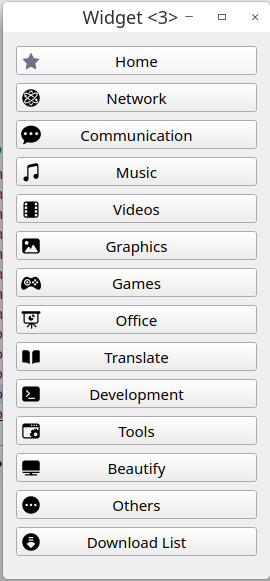

# 星火开发组Qt Demo
放一些大家写的Demo，方便参考学习和测试。    

## QPushButton 图标左对齐文字剧中
[QProxyStyleTest](./QProxyStyleTest/)  参考以下的内容      
* qpushbutton icon left alignment text center alignment 「Python实现的代码很简洁」https://stackoverflow.com/questions/56129402/qpushbutton-icon-left-alignment-text-center-alignment
* QPushButton icon aligned left with text centered 「第二个回答就是，但是好复杂唉」 https://stackoverflow.com/questions/44091339/qpushbutton-icon-aligned-left-with-text-centered

