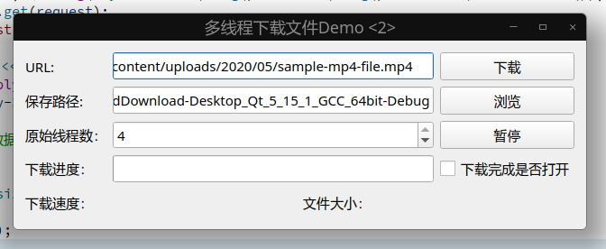

# 星火开发组Qt Demo
放一些大家写的Demo，方便参考学习和测试。    

## QPushButton 图标左对齐文字剧中
[QProxyStyleTest](./QProxyStyleTest/)  参考以下的内容      
* qpushbutton icon left alignment text center alignment 「Python实现的代码很简洁」https://stackoverflow.com/questions/56129402/qpushbutton-icon-left-alignment-text-center-alignment
* QPushButton icon aligned left with text centered 「第二个回答就是，但是好复杂唉」 https://stackoverflow.com/questions/44091339/qpushbutton-icon-aligned-left-with-text-centered

## 多线程下载
[MultiplethreadDownload](./MultiplethreadDownload/)         

测试视频下载地址 https://www.learningcontainer.com/wp-content/uploads/2020/05/sample-mp4-file.mp4       

多线程下如何更新下载进度的问题，还没解决。可以需要将线程任务单独拆分到Worker类里面。        

参考内容        
* CoverEars(迅雷不及掩耳，Qt版多线程下载器) https://github.com/xj361685640/CoverEars-Qt 

